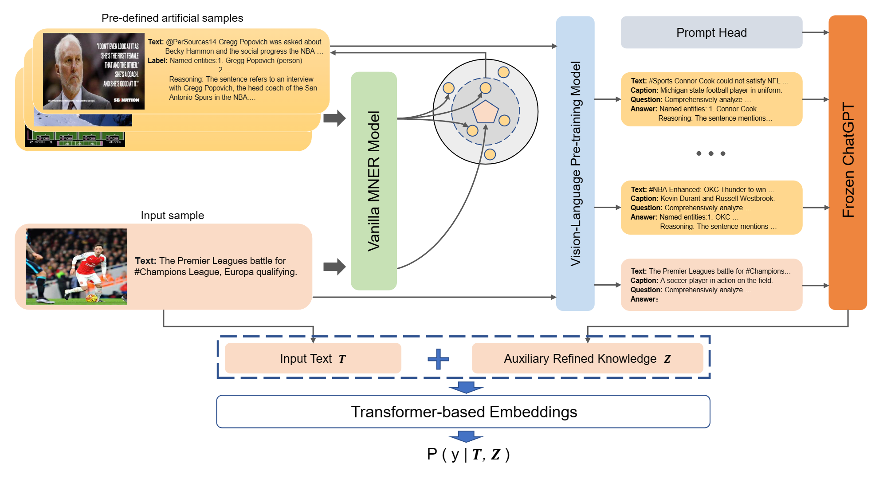

<div align="center">

<h1>Prompting ChatGPT in MNER: Enhanced Multimodal Named Entity Recognition with Auxiliary Refined Knowledge</h1>

[](https://paperswithcode.com/sota/multi-modal-named-entity-recognition-on-3?p=prompt-chatgpt-in-mner-improved-multimodal)
[](https://paperswithcode.com/sota/multi-modal-named-entity-recognition-on?p=prompt-chatgpt-in-mner-improved-multimodal)



</div>

Here are code and dataset for our Findings of EMNLP 2023 paper: [Prompting ChatGPT in MNER: Enhanced Multimodal Named Entity Recognition with Auxiliary Refined Knowledge](https://aclanthology.org/2023.findings-emnlp.184/)

# News

 - **[Mar. 2024]** [RiVEG](https://github.com/JinYuanLi0012/RiVEG) (the sequel to PGIM about GMNER) has been accepted to ACL 2024 Findings.
 - **[Oct. 2023]** PGIM has been accepted to EMNLP 2023 Findings.

# Dataset
To ease the code running, you can find our pre-processed datasets at [here](https://www.modelscope.cn/datasets/Dexter1202/PGIM/files). And the predefined artificial samples are [here](data/ManualAnnotation).

# Requirement
```
python == 3.7
torch == 1.13.1
transformers == 4.30.2
modelscope == 1.7.1
```

# Usage
PGIM is based on [AdaSeq](https://github.com/modelscope/AdaSeq), AdaSeq project is based on Python version >= 3.7 and PyTorch version >= 1.8.

## Step 1: Installation
```
git clone https://github.com/modelscope/adaseq.git
cd adaseq
pip install -r requirements.txt -f https://modelscope.oss-cn-beijing.aliyuncs.com/releases/repo.html
```

## Step 2: Copy PGIM folder into .../adaseq/examples/
```
-adaseq
---|examples
-----|PGIM
-------|twitter-15-txt.yaml
-------|twitter-17-txt.yaml
```

## Step 3: Replace the original adaseq folder with our adaseq folder
```
-adaseq
---|.git
---|.github
---|adaseq   <-- (Use our adaseq replace it)  
---|docs
---|examples
---|scripts
---|tests
---|tools
```

## Step 4: Training Model
-For Baseline:
```
	python -m scripts.train -c examples/PGIM/twitter-15.yaml
	python -m scripts.train -c examples/PGIM/twitter-17.yaml
```
-For PGIM:
```
	python -m scripts.train -c examples/PGIM/twitter-15-PGIM.yaml
	python -m scripts.train -c examples/PGIM/twitter-17-PGIM.yaml
```

# Citation
If you find PGIM useful in your research, please consider citing:
```
@inproceedings{li2023prompting,
  title={Prompting chatgpt in MNER: enhanced multimodal named entity recognition with auxiliary refined knowledge},
  author={Li, Jinyuan and Li, Han and Pan, Zhuo and Sun, Di and Wang, Jiahao and Zhang, Wenkun and Pan, Gang},
  booktitle={The 2023 Conference on Empirical Methods in Natural Language Processing},
  year={2023}
}
```

# Acknowledgement
Our code is built upon the open-sourced [AdaSeq](https://github.com/modelscope/AdaSeq) and [MoRe](https://github.com/modelscope/AdaSeq/tree/master/examples/MoRe), Thanks for their great work!
